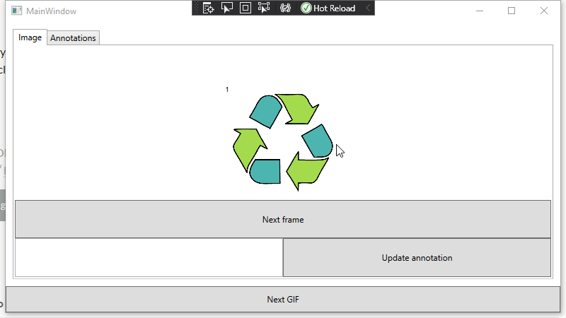

# MVVM-sample

This is a sample MVVM project where I'm trying to work out how (and if!) you can draw a line between ViewModels and Models.

Questions:
1. How can changes to the Annotations be synced to both tabs?
    * And if this involves making it an ObservableCollection or inheriting from ObservableObject, why even have the viewmodel?
2. How would this be modified to remember the current frame for each image when you swap between images.
    * Without adding it to the Model

